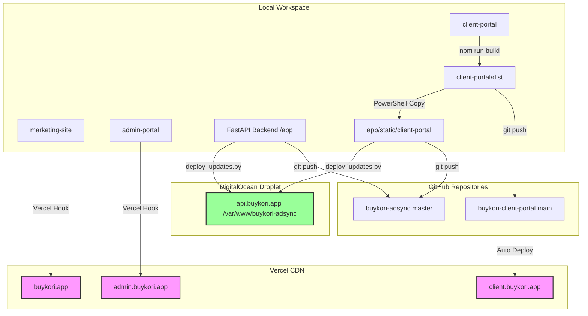

# 🌐 Buykori AdSync — Unified Deployment & Infrastructure Guide

This guide documents the setup, build steps, directory structures, and deployment procedures for all four components of the Buykori AdSync ecosystem.

---

## 🗺️ Architectural Mapping

```txt
buykori.app          ──► Marketing Landing Page (Vercel CDN)
client.buykori.app   ──► Client Portal Frontend (Vercel CDN + FastAPI static fallback)
admin.buykori.app    ──► Admin Portal Frontend (Vercel CDN)
api.buykori.app      ──► Production Backend & Workers (DigitalOcean Droplet)
```

---

## 📁 Components & Deployments

### 1. Marketing Site (`marketing-site/`)
* **Type:** Static HTML page (`index.html`, `vercel.json`).
* **Production Domain:** `https://buykori.app` & `https://www.buykori.app`
* **Vercel Deploy:** 
  Push to GitHub or deploy via Vercel CLI from the `marketing-site/` folder:
  ```bash
  cd marketing-site
  npx vercel --prod
  ```

---

### 2. Admin Portal (`admin-portal/`)
* **Type:** Static SPA (`index.html`, `app.js`, `styles.css`).
* **Production Domain:** `https://admin.buykori.app`
* **Vercel Deploy:**
  Push to GitHub or deploy via Vercel CLI from the `admin-portal/` folder:
  ```bash
  cd admin-portal
  npx vercel --prod
  ```

---

### 3. Client Portal (`client-portal/`)
* **Type:** React, TypeScript, and Vite SPA.
* **Production Domain:** `https://client.buykori.app`
* **Fallback Endpoint (Droplet Static):** Served by FastAPI on `/` via `/var/www/buykori-adsync/app/static/client-portal/`.
* **Local Build:**
  ```bash
  cd client-portal
  npm install
  npm run build
  ```
  *Generates production bundle in `client-portal/dist/`.*
* **Local Sync to Backend:**
  Run from the workspace root (PowerShell) to update the static fallback:
  ```powershell
  Remove-Item -Recurse -Force "app\static\client-portal\assets\*"
  Copy-Item -Recurse -Force "client-portal\dist\*" "app\static\client-portal\"
  ```
* **Vercel Deploy:**
  Push to GitHub (branch: `main` on repo: `buykori-client-portal`) which triggers automatic build, or run locally:
  ```bash
  cd client-portal
  npx vercel --prod
  ```

---

### 4. Production Backend (`app/` on DigitalOcean Droplet)
* **Type:** Python FastAPI API server, SQLAlchemy, PostgreSQL, and background worker queues.
* **SSH Host:** set through `DO_SSH_HOST` in your secure local environment or CI secret store.
* **Project Directory on Server:** `/var/www/buykori-adsync/`
* **Python Environment on Server:** `/var/www/buykori-adsync/venv/`
* **Service Manager:** Supervisor
* **Deployment Script (Local PC to Droplet):**
  From the workspace root directory, run:
  ```powershell
  python scratch/deploy_updates.py
  ```
  *This script connects to the droplet, copies changes via SFTP, runs database migrations, and restarts supervisor.*

---

## 🛠️ Droplet Command Sheet (SSH via deploy user)

Connect using your least-privilege deploy user and a pinned known-hosts entry. Avoid root/password SSH for normal operations.

### 1. Database Migrations (Alembic)
To upgrade the PostgreSQL database schema to the latest version:
```bash
cd /var/www/buykori-adsync
./venv/bin/alembic upgrade head
```

### 2. Service Controls (Supervisorctl)
* **Check Status of all services:**
  ```bash
  sudo supervisorctl status
  ```
  *Expected Output:*
  ```txt
  buykori-web                        RUNNING   pid 20109, uptime 0:10:45
  buykori-worker:buykori-worker_00   RUNNING   pid 20124, uptime 0:10:44
  buykori-worker:buykori-worker_01   RUNNING   pid 20125, uptime 0:10:44
  ```
* **Restart API server only:**
  ```bash
  sudo supervisorctl restart buykori-web
  ```
* **Restart Workers group only:**
  ```bash
  sudo supervisorctl restart buykori-worker:*
  ```
* **Restart all services:**
  ```bash
  sudo supervisorctl restart buykori-web buykori-worker:*
  ```

### 3. Log Inspections
To read production logs dynamically:
```bash
# Web API output logs
tail -f /var/log/supervisor/buykori-web.out.log

# Background worker output logs
tail -f /var/log/supervisor/buykori-worker.out.log
```

---

## 🗺️ Unified Deployment Infrastructure Diagram


